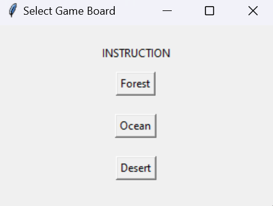
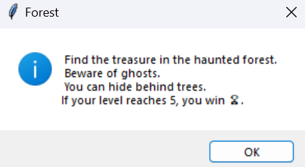
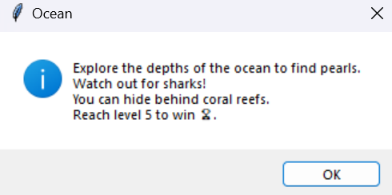
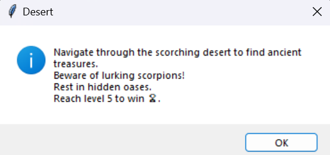
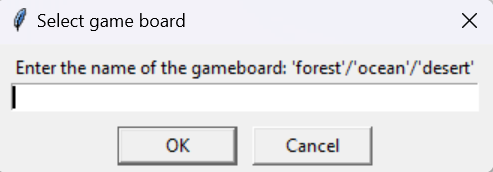
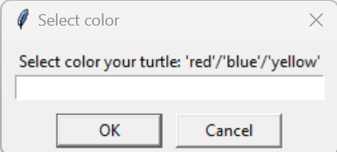

# PythonGame

# Projekt Gra w Pythonie

## Cel projektu
Projekt zakłada stworzenie gry w języku Python opartej na modelu klasowym oraz wykorzystującej bibliotekę Turtle. Głównym celem jest zapewnienie szerokiego spektrum rozgrywki, umożliwiając graczom wybór planszy, koloru postaci oraz zapewniając wzrost trudności wraz z kolejnymi poziomami.

## Narzędzia
- PyCharm
- Python

## Opis
Gra składa się z trzech różnych plansz, z których każda została opatrzona wcześniejszą instrukcją. Gracz może wybrać planszę poprzez wpisanie odpowiedniego słowa kluczowego, takiego jak "forest", "ocean" lub "desert", w wyznaczone pole.

Instrukcja plansza las

Instrukcja plansza ocean

Instrukcja plansza pustynia

Wybór planszy 

Gracz ma również możliwość wyboru koloru swojego awatara

