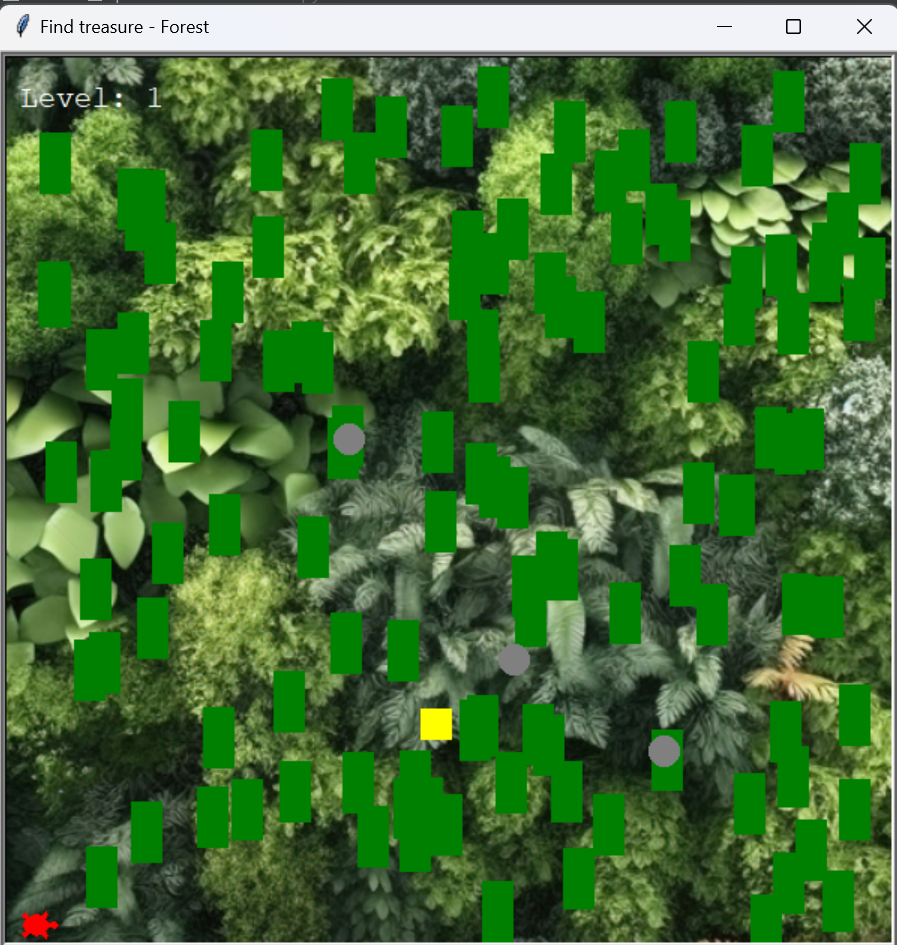
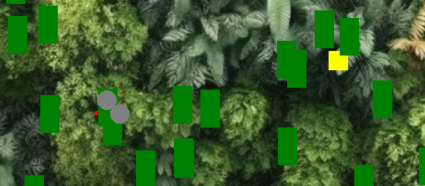
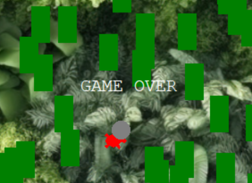
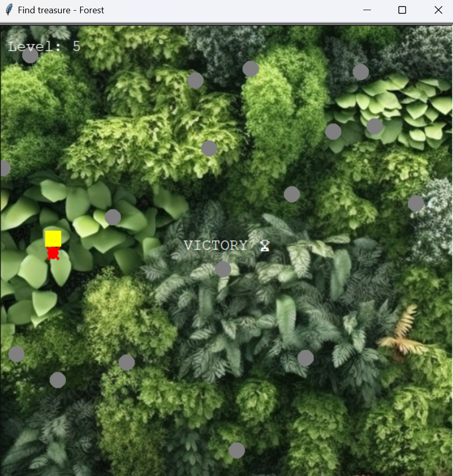
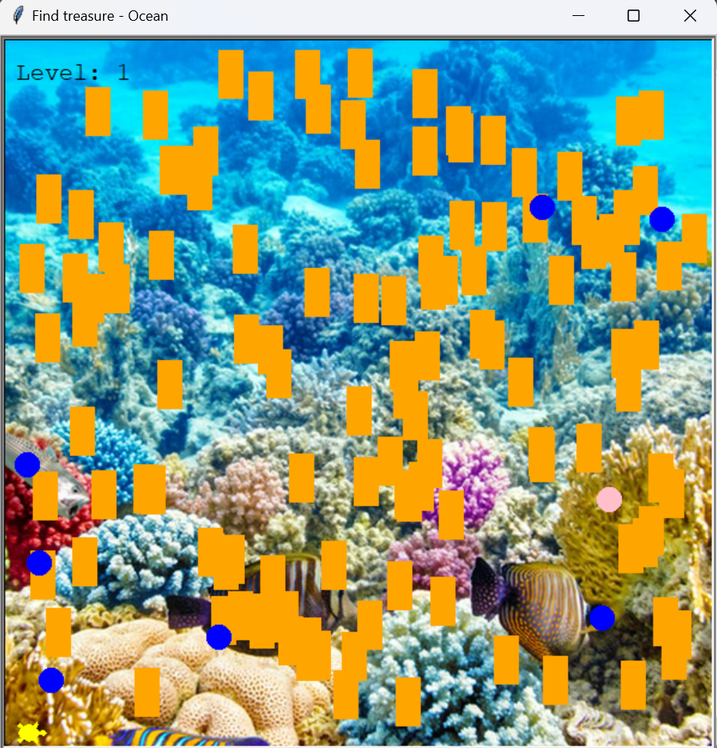
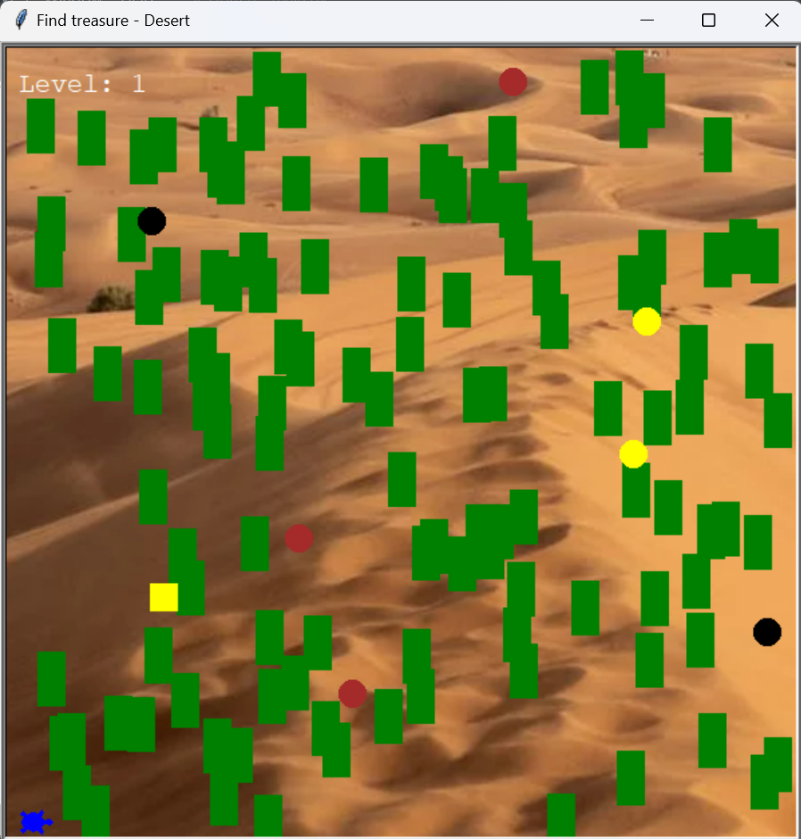

# PythonGame

# Projekt Gra w Pythonie

## Cel projektu
Projekt zakłada stworzenie gry w języku Python opartej na modelu klasowym oraz wykorzystującej bibliotekę Turtle. Głównym celem jest zapewnienie szerokiego spektrum rozgrywki, umożliwiając graczom wybór planszy, koloru postaci oraz zapewniając wzrost trudności wraz z kolejnymi poziomami.

## Narzędzia
- PyCharm
- Python

## Opis
Gra składa się z trzech różnych plansz, z których każda została opatrzona wcześniejszą instrukcją. Gracz może wybrać planszę poprzez wpisanie odpowiedniego słowa kluczowego, takiego jak "forest", "ocean" lub "desert", w wyznaczone pole. Dodatkowo, każda plansza jest opatrzona odpowiednim dźwiękiem, który pasuje do jej tematyki.

Instrukcja plansza las

Instrukcja plansza ocean

Instrukcja plansza pustynia

Wybór planszy 

Gracz ma również możliwość wyboru koloru swojego awatara

Pierwsza plansza, "Forest", która jest również domyślną planszą, generuje kryjówki, w których gracz może ukryć się przed poruszającymi się zagrożeniami. Celem gracza jest dotarcie do mety, reprezentowanej przez żółty obiekt. Gracz może poruszać się w dowolnym kierunku za pomocą strzałek na klawiaturze.

Ukrycie gracza 

W przypadku zderzenia z zagrożeniem gra automatycznie się kończy, a jednocześnie generowany jest dźwięk zderzenia, informujący gracza o niepowodzeniu.

Wraz z każdym kolejnym poziomem generowane są nowe ustawienia kryjówek dla gracza, a ich liczba stopniowo maleje. Po osiągnięciu piątego poziomu, liczba kryjówek spada do zera, co oznacza, że zdobycie tego poziomu gwarantuje zwycięstwo. Dodatkowo, wraz z postępem w grze, liczba oraz szybkość zagrożeń zwiększa się, stając się coraz większym wyzwaniem dla gracza.

Wygląd innych plansz

Ocean 

Pustynia 

